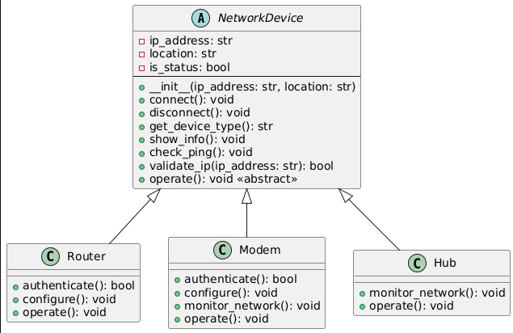

# 🌐 **CS 121 - Laboratory Activity 3**
The Laboratory Activity 3 in **CS 121** made by Group 7

## 🗂️ **Category Assignment**
Develop a Python program that demonstrates the use of classes and core Object-Oriented Programming (OOP) principles.

**Abstract Base Class:**
```NETWORK DEVICE``` 

## 👩‍💻Members
| Name | GitHub Profile |
|------|----------------|
|Lj G. Gamba|[Lj](https://github.com/rechelalala)|
|Rechel M. Umali|[rechelalala](https://github.com/rechelalala)|
|Edmar Visto|[ed](https://github.com/rechelalala)|

## 🔧 Overview
**Network Room** is a simulated network environment built with Python, allowing users to create and manage different types of network devices like Routers, Modems, and Hubs.
The system applies OOP principles to simulate connection handling, authentication, configuration, and monitoring functionalities typical in real-world networks.


## ✨ Features

- 📡 Add and manage network devices (Router, Modem, Hub)
- 🔌 Connect and disconnect devices dynamically
- 🔒 Simulate authentication and login procedures
- 📶 Configure WiFi (SSID, password) or ISP (bandwidth) settings
- 📈 Monitor signal strength and traffic broadcast
- 🛠️ Operate devices based on type-specific behaviors
- 📍 Track location and IP address of each device
- 📊 Simulate ping/response for diagnostics


## 💡 Device Behaviors

### 📡 Router
- Requires admin credentials
- Allows WiFi SSID and password configuration

### 🌐 Modem
- Requires ISP login
- Allows setting bandwidth limits
- Checks signal strength

### 🔁 Hub
- Lists connected devices
- Offers traffic broadcast monitoring

## 🗂️ Class Diagram: 

## 🧠 Code Description
A network device simulation system where users can create, configure, and interact with various network components. Designed using object-oriented programming principles, the system provides a hands-on, command-line experience of managing a basic digital network.

The users can choose between a **Router**, **Modem**, or **Hub** each with its own specialized behaviors:

🖧 The **Router** simulates a wireless gateway, allowing users to log in, configure WiFi settings (SSID and password), and manage local network traffic.  
```python
class Router(NetworkDevice):
    def authenticate(self):
        for attempt in range(3):
            print("\nEnter the router's login credentials:")
            username = input("Username: ").strip()
            password = input("Password: ").strip()
            if username and password:
                print("\nLogin successful.")
                return True
            else:
                print("\nInvalid credentials. Please try again.")
        print("\nAuthentication failed after 3 attempts.")
        return False

    def configure(self):
        while True:
            response = input("\nWould you like to configure your WiFi network? (yes/no): ").strip().lower()
            if response == "yes":
                ssid = input("Enter WiFi network name (SSID): ").strip()
                wifi_password = input("Enter WiFi password: ").strip()
                if ssid and wifi_password:
                    print(f"\nWiFi network '{ssid}' has been successfully configured.")
                    return
                else:
                    print("\nInvalid input. Both SSID and password must be provided.")
            elif response == "no":
                print("\nSkipping WiFi configuration.")
                return
            else:
                print("\nInvalid choice. Please enter 'yes' or 'no'.")

    def operate(self):
        if self.is_status:
            print("\nTo operate the router, connect it to a modem and Ethernet.")
            if self.authenticate():
                self.configure()
                print(f"\nRouter at {self.ip_address} is now managing network traffic.")
        else:
            print("\nRouter is offline. Connect it first.")
```
🌐 The **Modem** acts as a communication bridge between the local network and the ISP. It requires user authentication and optionally allows bandwidth configuration, followed by signal monitoring. 
```python
class Modem(NetworkDevice):
    def authenticate(self):
        for attempt in range(3):
            print("\nEnter your ISP credentials:")
            account_id = input("ISP Account ID: ").strip()
            password = input("ISP Password: ").strip()
            if account_id and password:
                print("\nAuthenticated with ISP successfully.")
                return True
            else:
                print("\nInvalid credentials. Please try again.")
        print("\nAuthentication failed after 3 attempts.")
        return False

    def configure(self):
        while True:
            response = input("\nWould you like to set a bandwidth limit? (yes/no): ").strip().lower()
            if response == "yes":
                try:
                    bandwidth = int(input("Enter bandwidth limit (in Mbps): ").strip())
                    if bandwidth > 0:
                        print(f"\nBandwidth limit set to {bandwidth} Mbps.")
                        return
                    else:
                        print("\nBandwidth must be a positive number.")
                except ValueError:
                    print("\nInvalid input. Please enter a numeric value for bandwidth.")
            elif response == "no":
                print("\nSkipping bandwidth configuration.")
                return
            else:
                print("\nInvalid choice. Please enter 'yes' or 'no'.")

    def monitor_network(self):
        print("\nChecking signal strength... Signal is stable.")

    def operate(self):
        if self.is_status:
            if self.authenticate():
                self.configure()
                self.monitor_network()
                print(f"\nModem at {self.ip_address} is now handling internet traffic.")
        else:
            print("\nModem is offline. Connect it first.")
```
🔁 The **Hub** functions as a basic data distributor, detecting and displaying all active connections. It can also enable optional network monitoring for tracking traffic activity across the network.
```python

class Hub(NetworkDevice):
    def monitor_network(self):
        while True:
            response = input("\nWould you like to enable network traffic monitoring? (yes/no): ").strip().lower()
            if response == "yes":
                print("Network traffic monitoring enabled.")
                return
            elif response == "no":
                print("\nSkipping network monitoring.")
                return
            else:
                print("\nInvalid choice. Please enter 'yes' or 'no'.")

    def operate(self):
        if self.is_status:
            print("\nChecking connected devices...")
            connected_devices = [dev.ip_address for dev in devices if dev.is_status]
            if connected_devices:
                print(f"Devices connected to the hub: {', '.join(connected_devices)}")
                print("Broadcasting data to all connected devices.")
            else:
                print("\nNo devices connected to the hub.")
            self.monitor_network()
        else:
            print("\nHub is offline. Connect it first.")
```

## 🧩 Object-Oriented Programming (OOP) Principles Demonstrated

### 🔒 Encapsulation
Each network device class hides sensitive attributes like status and credentials, and provides clean methods such as `connect()`, `disconnect()`, and `operate()` for controlled access and interaction.

### 🧱 Abstraction
The abstract class `NetworkDevice` defines essential behaviors like `operate()` and `show_info()` without specifying their implementation. Each subclass provides its own version of these behaviors.

### 🧬 Inheritance
Classes `Router`, `Modem`, and `Hub` inherit shared properties and methods from `NetworkDevice`, promoting code reuse and establishing a consistent interface across devices.

### 🔀 Polymorphism
Each subclass redefines the `operate()` method to execute device-specific logic. This allows the program to handle various device types uniformly while still performing distinct actions.

## 🙌 Acknowledgments
We would like to express our sincere gratitude to Ms. Fatima Agdon for her guidance and valuable feedback throughout this project. Her support has been invaluable in helping us achieve our goals. We also acknowledge the efforts of our groupmates for their dedication and teamwork. Together, we were able to successfully complete this laboratory activity.❤️
